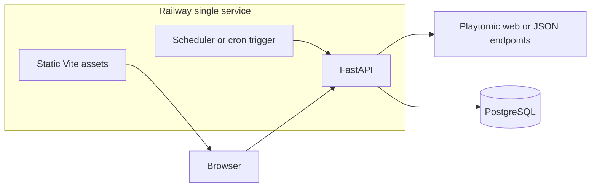

# don_padel: Switzerland padel availability (Playtomic MVP)

## What you decided (locked in)

- **Coverage:** Playtomic-only MVP; other booking systems later.
- **Data access:** Start from [playtomic.com](https://playtomic.com/padel-courts) / club pages (scraping mindset). In practice we will **verify in a discovery spike** whether pages are static HTML or a SPA that fetches JSON; if JSON is used (typical), we should call those endpoints with `httpx` and store responses—still not an official public API, but far more reliable than CSS selectors on rendered HTML.
- **History:** Long retention (years), bounded only by DB size and your retention policy.
- **Hosting:** One Railway service: **FastAPI serves REST + static Vite build** (simplest ops).

## Risks and constraints (important)

- **Terms of use:** Automated collection may violate Playtomic’s terms; rate-limit, cache aggressively, and consider reaching out to Playtomic for partnership later. Document this clearly for future-you and collaborators.
- **Stability:** Unofficial endpoints or HTML structure can change without notice—design ingestion to fail softly (alerts/logging) and version your parsers.
- **“All courts in Switzerland” on Playtomic:** We need a **canonical list of venue IDs** (or slugs) filtered to Switzerland. Discovery work will define whether we obtain this via search/geo endpoints, sitemap, or a one-time seed list maintained in-repo.

## High-level architecture

- **Ingestion:** Periodic job (hourly default; configurable) pulls venue list (less often) and availability windows (more often), normalizes into rows, stores with `captured_at` for time travel.
- **API:** Read endpoints for list + map + historical queries (e.g. “state at time T” or “slots in window”).
- **Frontend:** List view, map view (Leaflet + OSM tiles, or Mapbox if you add a token later), time picker / scrubber that queries the API for the selected instant or range.

## Proposed repository layout (monorepo)

- [`backend/`](backend/) — Python 3.12+, FastAPI, SQLAlchemy 2 + Alembic, `httpx` (and optionally `playwright` only if JSON cannot be reached without a headless browser—keep optional to limit Railway image size).
- [`frontend/`](frontend/) — Vite + React + TypeScript.
- [`README.md`](README.md) — Human overview, local dev, deployment, **legal disclaimer**.
- [`CONTEXT.md`](CONTEXT.md) — Machine-oriented project context for new chats (goals, stack, data model summary, ingestion assumptions, non-goals).

## Database model (initial sketch)

- **`venues`:** `id`, `playtomic_venue_id` (or slug), `name`, `lat`, `lng`, `country`, `raw_metadata` (JSONB), timestamps.
- **`ingestion_runs`:** `id`, `started_at`, `finished_at`, `status`, `error` (nullable), stats.
- **`availability_snapshots`:** `id`, `venue_id`, `court_label` (or `court_id` if stable), `slot_start`, `slot_end`, `status` (e.g. `free` / `booked` / `partial` if we can derive participant counts), `available_spots` (nullable int), `captured_at` (timestamptz), optional `source_payload` (JSONB, truncated).

Indexes: `(venue_id, slot_start)`, `(captured_at DESC)` for time-travel queries.

Retention: configurable (e.g. monthly partition or periodic prune of raw JSON); long history for **normalized rows** is the priority.

## Backend responsibilities

- **Config:** `pydantic-settings` for DB URL, fetch interval, geofence (Switzerland bbox or country code), user-agent string, request rate limits.
- **Jobs:** Either APScheduler inside the process **or** Railway Cron hitting a protected `/internal/ingest` route (secret header). Pick one in implementation; cron + idempotent ingest is easy to reason about.
- **API (public):**
  - `GET /venues` — filter Switzerland, include latest availability summary.
  - `GET /venues/{id}/availability?at=ISO8601` — resolved state at a point in time (latest snapshot with `captured_at <= at`).
  - `GET /map` — same as list but optimized payload for markers.

## Frontend responsibilities

- **List:** sort/filter; show free vs fully booked vs partial using latest snapshot for selected time.
- **Map:** markers colored by status; click opens detail.
- **Time navigation:** datetime control + “playhead” for historical view; debounced API calls.

## Railway deployment (single service)

- **Postgres:** Railway PostgreSQL plugin; connection string via env.
- **Build:** Docker recommended (one `Dockerfile` multi-stage: build frontend, install backend, copy static assets). Alternative: Nixpacks with build commands if you prefer no Dockerfile—Dockerfile is usually clearer for “API + static” in one container.
- **Process:** `uvicorn` running FastAPI; static mounted at `/` or `/app`, API under `/api` (avoid SPA routing conflicts with a catch-all for `index.html` only on non-API paths).

## Playtomic discovery spike (first implementation step)

Before writing lots of code:

1. Open a Swiss club on Playtomic in browser devtools → **Network** tab; identify requests returning schedule JSON and required headers/query params.
2. Decide minimal client: `httpx` vs Playwright.
3. Document findings in [`CONTEXT.md`](CONTEXT.md) (endpoints redacted if sensitive; keep internal notes).

## Git / GitHub (after you approve this plan)

You provided the exact sequence (`README.md`, `git init`, `main`, `git@github.com:yanchr/don_padel.git`). We will run that **after** the scaffold exists so the first commit includes the monorepo structure and context files—not an empty README only.

## Out of scope for v1 (explicit)

- User accounts, favorites, notifications.
- Booking through the app (read-only availability mirror).
- Non-Playtomic venues.
